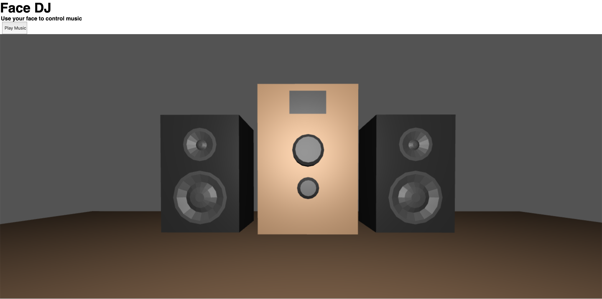

# Face DJ


Here's the [Live Demo on Glitch](https://cuinjune-face-dj.glitch.me/)

## Features
* Moving your head by X, Y position changes the song pattern.
* Moving your head by Z position changes the volume.
* Tilting the head based on the Y-axis controls the panning.
* Tilting the head based on the X-axis controls the filter cutoff.
* Opening/closing your mouth controls the filter resonance.
* Saying something to the microphone plays a vocoder.

## Setup
1. Installation of node.js is required. Follow [this guide](https://github.com/itp-dwd/2020-spring/blob/master/guides/installing-nodejs.md) to install it.
2. Run the following commands in the Terminal.
```
git clone https://github.com/cuinjune/face-dj.git
cd face-dj
npm install dependencies
npm start
```
3. Open your web browser and navigate to http://localhost:3000

## Tools used
[Tensorflow Facemesh library](https://github.com/tensorflow/tfjs-models/tree/master/facemesh), Three.js, Pure Data, SDL, Emscripten, Node.js, Express.js.

## Reporting bugs
Please post an [issue](https://github.com/cuinjune/face-dj/issues) if you face any problem (e.g. no music playing after clicking the “Play Music” button or speakers not moving) using the app. It seems like it’s not working properly on some machines.

## Author
* [Zack Lee](https://www.cuinjune.com/about): an MPS Candidate at [NYU ITP](https://itp.nyu.edu)
